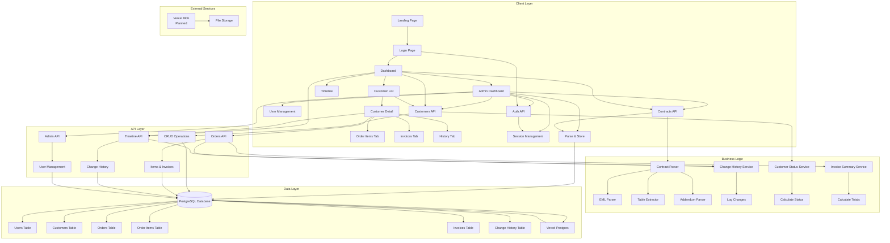
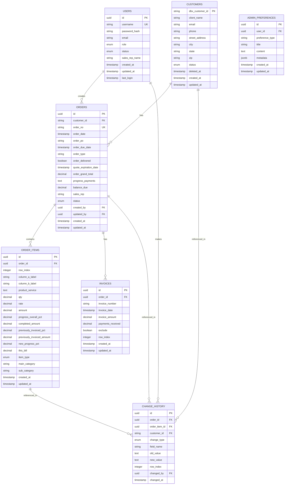

# Calimingo Pools - Contract Management System

A comprehensive Next.js web application for managing build contracts, parsing EML files, tracking customer orders, managing invoices, and maintaining a complete audit trail of all changes. The system includes user authentication, role-based access control, and a unified dashboard for contract management.

## Table of Contents

- [Features](#features)
- [Architecture](#architecture)
- [Getting Started](#getting-started)
- [User Management](#user-management)
- [Contract Management](#contract-management)
- [Database Schema](#database-schema)
- [API Endpoints](#api-endpoints)
- [Deployment](#deployment)
- [Documentation](#documentation)
- [Next Steps](#next-steps)

## Features

### 1. User Authentication & Management

- **User Registration**: New users can register and await admin approval
- **Role-Based Access Control**: Six user roles with different permissions:
  - `admin`: Full system access, user management
  - `contract_manager`: Contract and order management
  - `sales_rep`: Customer and order management (filtered by sales rep name)
  - `accountant`: Financial data access
  - `viewer`: Read-only access
  - `vendor`: Limited access
- **Admin Dashboard**: 
  - Comprehensive admin panel with sidebar navigation
  - Approve/reject user registrations with alert notifications
  - Assign roles to users
  - Reset user passwords
  - Manage user status (active/suspended)
  - Quick actions panel for common tasks
  - Pending items overview with quick approve actions
  - Recent activity feed
  - Admin notes, to-do list, and maintenance calendar (database-synced)
  - Audit logs with filtering and pagination
  - Data management tools (trash cleanup, database stats)
  - Reports and analytics dashboard
  - System settings management
  - Mobile-optimized responsive design
- **Session Management**: Secure cookie-based sessions with automatic expiration

### 2. Contract Parsing & Generation

- **EML File Parsing**: Parse `.eml` email files containing signed build contracts
- **Order Items Extraction**: Extract order items, categories, and subcategories from email HTML tables
- **Location Extraction**: Extract client information, DBX Customer ID, order number, and address from email text
- **Addendum Support**: 
  - Auto-detection of "Original Contract" and "Addendum" links from EML email bodies
  - Manual addendum URL parsing from ProDBX public URLs
  - Multiple addendums processing in sequence
- **Excel Generation**: Generate formatted Excel spreadsheets using `Template-V2.xlsx` template
- **Template-Based**: Preserves formulas, structure, and conditional formatting

### 3. Dashboard & Customer Management

- **Unified Dashboard**: 
  - Overview statistics (total customers, contracts, value)
  - Recent contracts list (sorted by latest to oldest)
  - Quick access to upload contracts
- **Customer List View**:
  - Search and filter customers
  - Status indicators (Pending Updates / Completed)
  - Validation warnings for data mismatches
  - Soft-delete support with trash view
- **Customer Detail View**:
  - Customer information display
  - Job information display
  - Order items table with editing capabilities
  - Invoice management
  - Invoice summary with auto-calculations
  - History timeline for customer-specific changes

### 4. Order Items Management

- **Editable Order Table**:
  - Inline editing of all order item fields
  - Drag-and-drop row reordering
  - Add/delete rows (main categories, subcategories, line items)
  - Real-time formula calculations:
    - Completed Amount = Progress Overall % × Amount
    - Previously Invoiced Amount = Amount × Previously Invoiced %
    - New Progress % = Progress Overall % - Previously Invoiced %
    - This Bill = New Progress % × Amount
- **Data Validation**:
  - Alerts when order items total doesn't match Order Grand Total
  - Parsing quality indicators (location parsing status)
- **Auto-save**: Changes are automatically saved to database

### 5. Invoice Management

- **Invoice Table**: 
  - Add, edit, and delete invoices
  - Track invoice number, date, amount, and payments received
  - Exclude option for invoices
- **Invoice Summary**:
  - Original Invoice (from order items)
  - Balance Remaining
  - Total % Completed
  - Less Payments Received (sum of all invoice payments)
  - Auto-updates based on order items and invoices

### 6. Change History & Timeline

- **Universal Timeline**: 
  - View all changes across the system
  - Filter by period (day/week/month/all)
  - Pagination (load 10 at a time)
  - Visual timeline with alternating left/right entries
  - Expandable details showing old/new values
- **Customer History**: 
  - Customer-specific change history
  - Accessible from customer detail page
  - Same filtering and pagination features
- **Change Tracking**:
  - Tracks all user actions (cell edits, row additions/deletions, customer/order updates)
  - Groups related changes into single entries
  - Excludes computed fields from logging
  - Links to DBX Customer IDs and Order Numbers

### 7. Data Management

- **Soft Delete**: 
  - Customers can be soft-deleted (moved to trash)
  - 30-day retention period
  - Recovery functionality
  - Automatic cleanup of old trash entries
- **Customer Status**: 
  - Automatic calculation based on orders and invoices
  - Status: "Pending Updates" or "Completed"
- **Data Validation**: 
  - Order items total validation
  - Parsing quality checks
  - Warning indicators for data mismatches

## Architecture

### System Architecture Diagram



### Technology Stack

**Frontend**:
- Next.js 14 (App Router)
- React 18 with TypeScript
- Tailwind CSS
- shadcn/ui components
- Framer Motion (animations)
- @dnd-kit (drag and drop)

**Backend**:
- Next.js API Routes (serverless functions)
- Node.js 18+
- Drizzle ORM
- Vercel Postgres (Neon)

**Libraries**:
- ExcelJS (Excel generation)
- mailparser (EML parsing)
- cheerio (HTML parsing)
- bcryptjs (password hashing)

### Database Schema



## Getting Started

### Prerequisites

- Node.js 18+ (for native `fetch` support)
- npm or yarn
- PostgreSQL database (Vercel Postgres/Neon recommended)
- Vercel account (for deployment)

### Installation

1. **Clone the repository**:
```bash
git clone <repository-url>
cd CalimingoPools
```

2. **Install dependencies**:
```bash
npm install
```

3. **Set up environment variables**:
Create a `.env.local` file:
```env
POSTGRES_URL=your_postgres_connection_string
NODE_ENV=development
```

4. **Set up the database**:
```bash
# Push schema to database
npx drizzle-kit push

# Or generate migrations
npx drizzle-kit generate
npx drizzle-kit migrate
```

5. **Place the template file**:
   - Ensure `contract-parser/Template-V2.xlsx` exists
   - This template contains formulas, structure, and conditional formatting

6. **Run the development server**:
```bash
npm run dev
```

7. **Open your browser**:
Navigate to `http://localhost:3000`

### First-Time Setup

1. **Create Admin User** (via database or admin interface):
   - Insert a user record with `role='admin'` and `status='active'`
   - Or use the admin interface if available

2. **Login**:
   - Navigate to `/login`
   - Enter admin credentials

3. **Upload First Contract**:
   - Go to Dashboard
   - Click "Upload Contract"
   - Upload an EML file
   - System will parse and store the contract

## User Management

### User Roles

- **Admin**: Full system access, can manage users, view all customers and contracts
- **Contract Manager**: Can manage contracts and orders
- **Sales Rep**: Can view and manage customers/orders assigned to their sales rep name
- **Accountant**: Can view financial data and invoices
- **Viewer**: Read-only access to all data
- **Vendor**: Limited access (customizable)

### User Registration Flow

1. User registers with username and password
2. User status is set to `pending`
3. Admin receives notification (via admin dashboard)
4. Admin approves/rejects and assigns role
5. User can login once approved

### Admin Functions

- View pending registrations
- Approve/reject users
- Assign roles
- Reset passwords
- Suspend/activate users
- View all users and their activity

## Contract Management

### Upload & Parse Contract

1. **From Dashboard**:
   - Click "Upload Contract" button
   - Select EML file
   - System parses and displays customer sheet view
   - Click "Save to Dashboard" to store

2. **From Landing Page**:
   - Upload EML file
   - System generates spreadsheet immediately
   - Download spreadsheet

### Contract Parsing Features

- **Automatic Detection**: Detects customer info, job info, and order items
- **Validation**: 
  - Checks if location info parsed correctly
  - Validates order items total matches grand total
  - Shows warning icons for data issues
- **Re-parsing**: Can re-upload contract in edit mode to re-parse
- **Manual Editing**: Edit customer/job info manually if parsing fails

### Order Items Management

- **Edit Mode**: Click "Edit Table" to enable editing
- **Inline Editing**: Click any cell to edit
- **Drag & Drop**: Reorder rows by dragging
- **Add Rows**: Add main categories, subcategories, or line items
- **Delete Rows**: Remove unwanted rows
- **Auto-calculations**: Formulas calculate automatically
- **Save**: Click "Save" to persist changes

### Invoice Management

- **Add Invoice**: Click "Add Invoice" button
- **Edit Invoice**: Click edit icon on invoice row
- **Delete Invoice**: Click delete icon
- **Invoice Summary**: Auto-updates based on:
  - Order items total
  - Invoice payments received
  - Completed amounts

## Database Schema

### Tables

1. **users**: User accounts and authentication
2. **customers**: Customer information (primary key: `dbx_customer_id`)
3. **orders**: Order/contract information
4. **order_items**: Individual line items in orders
5. **invoices**: Invoice records for orders
6. **change_history**: Audit trail of all changes
7. **admin_preferences**: Admin notes, todos, and maintenance items (user-specific)

### Key Relationships

- `customers.dbx_customer_id` → `orders.customer_id` (string FK)
- `orders.id` → `order_items.order_id` (UUID FK)
- `orders.id` → `invoices.order_id` (UUID FK)
- `users.id` → `change_history.changed_by` (UUID FK)
- `orders.id` → `change_history.order_id` (UUID FK, nullable)
- `customers.dbx_customer_id` → `change_history.customer_id` (string FK, nullable)

### Indexes

- `users.username` (unique)
- `orders.order_no` (unique)
- `change_history.changed_at` (for timeline queries)
- `change_history.customer_id` (for customer history)
- `change_history.order_id` (for order-specific queries)

## API Endpoints

### Authentication
- `POST /api/auth/login` - User login
- `POST /api/auth/logout` - User logout
- `GET /api/auth/session` - Get current session

### Contracts
- `GET /api/contracts` - List all contracts
- `POST /api/contracts` - Create new contract
- `GET /api/contracts/[id]` - Get contract by ID
- `PUT /api/contracts/[id]` - Update contract
- `POST /api/contracts/[id]/generate-spreadsheet` - Generate Excel

### Customers
- `GET /api/customers` - List customers (with filters)
- `DELETE /api/customers/[id]` - Soft delete customer
- `POST /api/customers/[id]/recover` - Recover deleted customer
- `GET /api/customers/[id]/history` - Get customer change history
- `POST /api/customers/cleanup-trash` - Permanently delete old trash

### Orders
- `PUT /api/orders/[id]/items` - Update order items
- `GET /api/orders/[id]/invoices` - List invoices
- `POST /api/orders/[id]/invoices` - Create invoice
- `PATCH /api/orders/[id]/invoices/[invoiceId]` - Update invoice
- `DELETE /api/orders/[id]/invoices/[invoiceId]` - Delete invoice
- `GET /api/orders/[id]/invoice-summary` - Get invoice summary

### Timeline
- `GET /api/timeline` - Get universal timeline (with filters)

### Admin
- `GET /api/admin/users` - List all users
- `POST /api/admin/users` - Create user
- `PATCH /api/admin/users/[id]` - Update user
- `POST /api/admin/users/[id]/reset-password` - Reset password
- `GET /api/admin/preferences` - Get admin preferences (notes, todos, maintenance)
- `POST /api/admin/preferences` - Create admin preference
- `PATCH /api/admin/preferences/[id]` - Update admin preference
- `DELETE /api/admin/preferences/[id]` - Delete admin preference

### Parsing
- `POST /api/parse-contract` - Parse EML file (returns JSON or Excel)

## Deployment

### Vercel Deployment

1. **Connect Repository**:
   - Push code to GitHub
   - Connect repository to Vercel

2. **Configure Environment Variables**:
   - `POSTGRES_URL`: Your Vercel Postgres connection string
   - `NODE_ENV`: `production`

3. **Deploy**:
   - Vercel will automatically deploy on push
   - Or manually deploy via Vercel dashboard

### Database Setup

1. **Create Vercel Postgres Database**:
   - In Vercel dashboard, create Postgres database
   - Copy connection string

2. **Run Migrations**:
   ```bash
   npx drizzle-kit push
   ```

3. **Verify Schema**:
   - Check that all tables are created
   - Verify indexes are in place

### Build Configuration

The `next.config.js` is configured to:
- Mark server-only modules as external (`exceljs`, `mailparser`, `cheerio`)
- Provide fallbacks for Node.js core modules
- Exclude `lib/` modules from client-side bundling

## Documentation

Comprehensive documentation is available in the `docs/` directory:

- **[Architecture Documentation](docs/ARCHITECTURE.md)** - Detailed system architecture, technology stack, and design decisions
- **[Maintainability Guide](docs/MAINTAINABILITY.md)** - Code organization, patterns, best practices, and maintenance procedures
- **[Scalability Guide](docs/SCALABILITY.md)** - Scaling strategies, performance optimization, and future considerations
- **[Trash Cleanup Documentation](docs/TRASH_CLEANUP.md)** - Data cleanup procedures and policies

## Next Steps

### Planned Features

1. **Vercel Blob Integration**:
   - Store uploaded EML files as historical data
   - Track original contract files
   - Enable re-download of original files

2. **Enhanced Timeline**:
   - View-only or restricted access based on user roles
   - Advanced filtering (by user, change type, date range)
   - Export timeline to CSV/PDF
   - Real-time updates via WebSocket

3. **Reporting & Analytics**:
   - Customer status reports
   - Order completion tracking
   - Financial summaries
   - Sales rep performance metrics

4. **Notifications**:
   - Email notifications for status changes
   - Alerts for data validation issues
   - Admin notifications for pending approvals

5. **Advanced Search**:
   - Full-text search across customers and orders
   - Filter by multiple criteria
   - Saved search queries

6. **Bulk Operations**:
   - Bulk customer updates
   - Bulk invoice creation
   - Export multiple contracts

7. **API Enhancements**:
   - RESTful API documentation (OpenAPI/Swagger)
   - API rate limiting
   - Webhook support for external integrations

8. **Mobile Responsiveness**:
   - Optimize for mobile devices
   - Touch-friendly drag and drop
   - Mobile-optimized forms

9. **Performance Optimizations**:
   - Implement caching strategies
   - Optimize database queries
   - Lazy loading for large datasets

10. **Security Enhancements**:
    - Two-factor authentication
    - Audit logging for admin actions
    - IP whitelisting for admin access

## Configuration

### Environment Variables

Required:
- `POSTGRES_URL`: PostgreSQL connection string

Optional:
- `NODE_ENV`: Environment (development/production)
- `NEXT_PUBLIC_APP_URL`: Application URL (for redirects)

### Template Files

**`contract-parser/Template-V2.xlsx`**:
- Contains formulas in columns I-BE
- Has structure in rows 1-15
- Has conditional formatting based on Column A values (rows 16-339)
- Required for spreadsheet generation

## Error Handling

### Common Errors

**"Order Items Table not found"**:
- The email HTML doesn't contain a table with class "pos"
- The parser will try to use the first table as fallback

**"Failed to parse customer information"**:
- EML file format may be different
- Use "Edit Customer Info" to manually update
- Try re-uploading the contract

**"Foreign key constraint violation"**:
- Usually occurs when deleting items with change history
- System automatically clears references before deletion

### Debugging

Enable debug logging by checking console output:
- `[API]` prefix: API route logs
- `[changeHistory]` prefix: Change logging
- `[CustomerDetailPage]` prefix: Page-level logs

## Limitations

1. **Template Dependency**: Requires `Template-V2.xlsx` file
2. **Row Limits**: Maximum 339 rows for data (rows 16-339)
3. **Sheet Name Length**: Excel sheet names limited to 31 characters
4. **File Size**: Large EML files may exceed serverless function timeout
5. **URL Accessibility**: Addendum URLs must be publicly accessible

## Contributing

1. Fork the repository
2. Create a feature branch (`git checkout -b feature/amazing-feature`)
3. Commit your changes (`git commit -m 'Add some amazing feature'`)
4. Push to the branch (`git push origin feature/amazing-feature`)
5. Open a Pull Request

## License

This project is proprietary software. All rights reserved.

## Support

For issues or questions:
1. Check the error messages in the console
2. Verify EML file format and database connectivity
3. Check that the template file exists and is valid
4. Review the API documentation

## Changelog

### Version 2.1.0 (Current - Enhanced Admin Panel)
- Redesigned admin panel with sidebar navigation (mobile-responsive)
- Added admin overview dashboard with quick actions
- Added pending items section with alert notifications
- Added recent activity feed
- Added admin notes widget (database-synced)
- Added to-do list widget (database-synced)
- Added maintenance calendar widget (database-synced)
- Added audit logs page with filtering and pagination
- Added data management page with trash cleanup tools
- Added reports and analytics dashboard
- Added system settings page
- Implemented database sync for admin preferences
- Enhanced mobile optimization for emergency access

### Version 2.0.0 (Full Management System)
- Added user authentication and role-based access control
- Added admin dashboard for user management
- Added unified dashboard with customer management
- Added order items editing with drag-and-drop
- Added invoice management system
- Added change history and timeline feature
- Added soft delete and recovery functionality
- Added customer status calculation
- Added data validation and warning indicators
- Migrated from in-memory storage to PostgreSQL database
- Added comprehensive API endpoints

### Version 1.4.0 (Auto-Detection & Subcategory Support)
- Added auto-detection of "Original Contract" and "Addendum" links
- Added Original Contract parsing with full support
- Added subcategory detection
- Enhanced error handling with detailed feedback

### Version 1.3.0 (Template-V2.xlsx Support)
- Added Template-V2.xlsx support
- Removed manual formatting feature
- All formatting handled by template

### Version 1.2.0 (Addendum Support)
- Added addendum URL parsing support
- Added multiple addendum processing

### Version 1.0.0 (Initial Release)
- EML file parsing
- Order items extraction
- Excel spreadsheet generation
